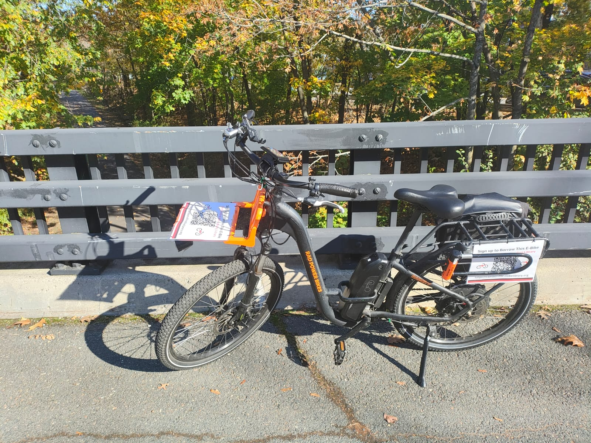

+++
date = 2023-11-16T13:47:53-05:00
title = "Aside: The Camberville E-Bike Lending Library"
+++

This is a good week for a bit of a fluffy post: I’ve been really busy with the
first full week of [DASCH] photographic plate scanning, restarting after a
2.5-year hiatus and nearly an entire year of preparatory work! More on that
soon. In the meantime, something non-academic: an *extremely* stereotypical
“E-bikes!” post. I have approximately zero novel observations to offer, but I at
least want to make sure that any e-bike-curious people in the Boston area know
about the [Camberville E-bike Lending Library][cell].

[DASCH]: http://dasch.rc.fas.harvard.edu/
[cell]: https://camberville.ebikelibrary.org/

<!-- more -->

The [lending library][cell] is a free, not-for-profit operation run by basically
one person, Christopher Schmidt. As far as I can tell he just loves e-bikes and
wants to make sure that anyone who wants to try one has the chance, and he’s
doing a great job of that! Through the library I was able to borrow a [RadBikes
RadCity 3][rc3] for a whole week. I believe that there are bike shops that will
let you borrow one for a few hours, but it felt super helpful to be able to try
it out over a longer period of time and feel out the best route for my commute,
etc.

[rc3]: https://www.radpowerbikes.com/collections/radcity-electric-city-bikes

Pretty much everyone that I’ve ever interacted with who’s tried riding e-bikes
has been an instant convert. No suspense here: me too. It’s worth emphasizing,
though, that really my *only* use case is commuting, and my particular commute
turns out to be a nearly perfect fit for the e-bike lifestyle.

The quantifiables are as follows. My baseline is a bus commute, taking the 71
from Watertown to Harvard, with ~10-minute walks on both ends. I budget about 45
minutes to get in, not counting how I might delay my departure to sync up with
the bus schedule. Overall, it’s OK, but it takes longer than I’d like and
unpredictable delays from traffic and MBTA snafus can be unpleasant. For
instance, I generally try to head from from work either before 4:45, or after
6:30, because rush hour out of Cambridge is just that gnarly.

For reference, Google Maps tells me that a door-to-door drive in light traffic
would be something like 17 minutes. At rush hour, the drive can take 30 minutes
or more, and the overall experience is deeply unpleasant: long stretches of
stop-and-go traffic that put you and everyone else in a bad mood.

With the RadCity on my preferred route, my commute came in at 22–25 minutes in
cold but dry weather, with traffic being basically a non-factor. One discovery
that had nothing to do with the “e-” part of the bike: I really didn’t
appreciate the quality of some of the new(-ish) bike infrastructure near me. The
[Watertown-Cambridge Greenway][wcg] takes the subjective feeling of my bike
commute route from “not worth it” (I’m only willing to bike down Mt. Auburn St.
when it’s completely empty, and even then it’s not exactly pleasant) to “simply
delightful”. I can get onto the Greenway from my house using safe-feeling
residential streets, and I can get from the Greenway to the CfA along the
comparably safe-feeling bike lanes of Huron Ave. I’m really glad that Watertown
and Cambridge are investing in this kind of infrastructure — and really angry at
[John Forester][forester] and the [vehicular cycling][vc] ideology, who probably
set American cycling infrastructure back *decades* while also getting a good
number of people literally killed. That’s not hyperbole.

[wcg]: https://www.cambridgema.gov/cdd/projects/transportation/watertowncambridgegreenway
[forester]: https://en.wikipedia.org/wiki/John_Forester_(cyclist)
[vc]: https://en.wikipedia.org/wiki/Vehicular_cycling

As for the “e-” part of the bike, it was pretty much exactly what I expected.
Yes, the motor can help you get up a hill or maintain speed on a straightaway
without having to put any real effort in. And, yes, it can be incredibly
helpful! Not literally but *emotionally* it felt like both directions of my
commute were gentle downhills — pedal as hard as you feel like, old chap, we’ll
make good time. The battery can also power bright lights that make nighttime
biking feel comparatively safe.

Now, I follow professional cycling enough to instantly associate bikes with
suffering, and there’s a large part of me that can’t shake the feeling that this
is all, somehow, cheating. But while I wouldn’t want to say that a feeling can
be *wrong* … stepping back, it’s as close to that as feelings can get. In some
circumstances, it matters where a bike’s power is coming from, and in other
circumstances, it doesn’t. When it doesn’t, let’s not judge, not even ourselves.
There’s nothing more to be said.

All in all, I got exactly what I wanted out of my e-bike borrowing experience —
it really helped to have plenty of time to get a feel for what it would be like
own one. Since I know a lot of e-bike evangelists, the bigger revelation for me
was less about the experience of riding one and more about the infrastructure
that Watertown and Cambridge have started building. For my particular commute,
the electric support turns the bike from a *nice* mode of transit to the
hands-down *best* one. As things currently stand, I’m not sure what could beat
the combination of the segregated bikeway — allowing me to sidestep rush-hour
congestion — and power support — removing the “man I really don’t feel like
grinding up this hill right now” factor. (No, it won’t be the best option in the
middle of a blizzard or if I need to pick up some 2×4’s on the way home, but I’d
guess that the bike would work well for something like 90% of my commute days.)
So, big thanks not only to Chris for operating the [Camberville E-bike Lending
Library][cell], but also to the politicians of Watertown and Cambridge for
making the paths.
